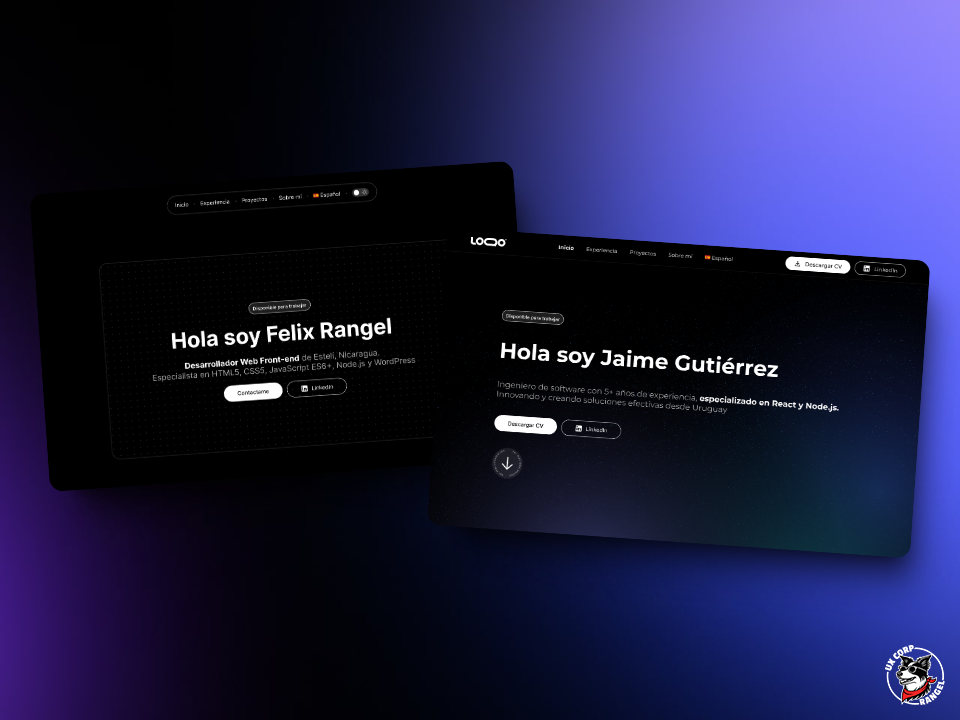

# 🦄 Portfolios Dev

Una colección única de plantillas de portafolios para desarrolladores. Obtén un portafolio profesional, moderno y personalizable, resalta tus proyectos, tu experiencia y destaca en el mundo tech con diseños que impresionan.

## 🙌 Motivación

[Ana Rangel](https://www.linkedin.com/in/ux-ana-rangel), creadora de [UXCorpRangel](https://www.linkedin.com/company/uxcorprangel/), diseñó esta colección de portafolios como un tributo a la comunidad que la ayudó en el desarrollo de su [portafolio](https://anarangel.github.io/). Ana decidió devolver ese valor con plantillas que cualquier desarrollador pueda usar para mejorar su propio portafolio. Estas plantillas no solo reflejan su creatividad y experiencia, sino que también son una herramienta accesible para que otros desarrolladores destaquen sus proyectos y habilidades de manera profesional.

## 👀 Características

- ⭐ Diseño moderno y personalizable.
- 🖥️ Diseño adaptable a diferentes tamaños de pantalla.
- 🌎 Disponible para múltiples idiomas.
- ⚡ Enfoque en el rendimiento.
- 🌗 Soporte para tema claro y oscuro.

## 📦 Stack

- 🚀 [Astro](https://astro.build/) - El framework web para sitios web basados en contenidos.
- 🏷️ [Typescript](https://www.typescriptlang.org/) - JavaScript con sintaxis para tipos.
- 💅 [Sanitize.css](https://github.com/csstools/sanitize.css) - Una colección de estilos de reset CSS.

## ✨ Plantillas

### [🦄 Unicorn Sparkle](./unicorn-sparkle)

[](./unicorn-sparkle)

#### 🤔 ¿Cómo usar?

Para utilizar la plantilla [Unicorn Sparkle](./unicorn-sparkle) puedes copiar y ejecutar el siguiente comando en tu terminal:

Con NPM:

```bash
npm create astro@latest -- --template UXCorpRangel/portfolios-dev/unicorn-sparkle
```

Con PNPM:

```bash
pnpm create astro@latest -- --template UXCorpRangel/portfolios-dev/unicorn-sparkle
```

Luego entra en la carpeta de tu portafolio, instala las dependencias y ¡listo! 🎉.

## 🤝 Contribuir

Si deseas contribuir a este proyecto, puedes hacerlo leyendo la [Guía de Contribución](./CONTRIBUTING.md).

## 📄 Licencia

Este proyecto utiliza la Licencia MIT. Consulte el [Archivo de Licencia](./LICENCE) para obtener más información.

---

Diseñado con ❤️ por [Ana Rangel](https://www.linkedin.com/in/ux-ana-rangel) y desarrollado con 💙 por [Felix Icaza](https://felixicaza.com).
